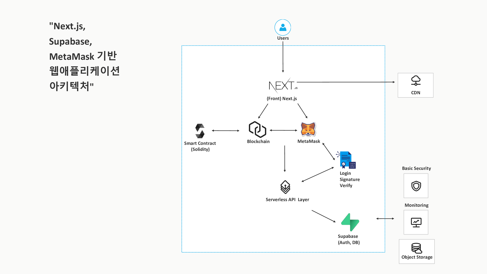

# Web Application Architecture

> Based on Next.js, Supabase, MetaMask, Smart Contracts.

## 주요 구성 요소

- **Next.js**: 프론트엔드 프레임워크
- **MetaMask**: Web3 지갑, 로그인 시 서명 사용
- **Supabase**: 인증, DB, 스토리지
- **Smart Contract (Solidity)**: 블록체인 상의 로직
- **CDN / Object Storage**: 정적 자산 전달
- **Serverless API Layer**: Next.js API route 또는 별도 Lambda 등
